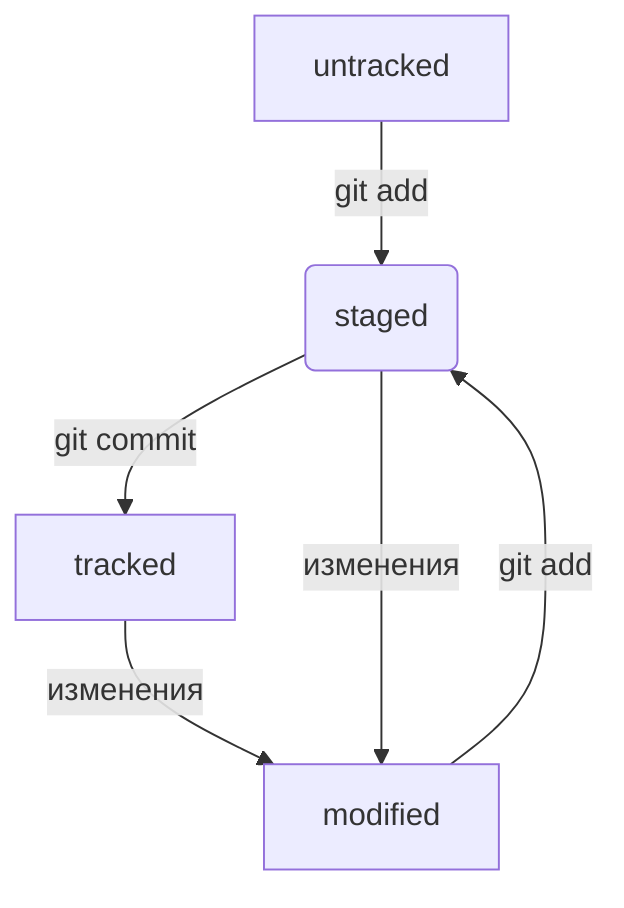

# Что нужно знать про Git и Github

## Урок 1

**Git** — это система контроля версий, которая помогает отслеживать изменения в проекте.

Хранение, изменение и анализ истории — основные функции системы контроля версий.

В командной строке вы тоже всегда находитесь в какой-то папке — просто этого не видно. Узнать, где вы сейчас, поможет команда **pwd**

С помощью терминала вы всегда можете перейти к домашней директории. Для этого нужно ввести команду **cd**

Сделать папку репозиторием — **git init**

«Разгитить» папку, если что-то пошло не так, — **rm -rf .git**

Проверить состояние репозитория — **git status**

Выполнить коммит — **git commit**

Сделать коммит можно командой **git commit** c ключом **-m**, который присваивает коммиту сообщение.

## Урок 2

_SSH_ — протокол, который обеспечивает безопасный обмен данными в сети и использует для этого ключи.

_SSH-ключ_ — ваш виртуальный идентификатор в GitHub. Как ключ от квартиры, он позволяет получить доступ к GitHub-репозиторию. Также SSH используется для доступа к другим удалённым серверам.

SSH-ключ состоит из двух частей — публичной и приватной. Публичный ключ зашифрует данные, а приватный — расшифрует. Приватным ключом ни в коем случае нельзя делиться, иначе любой сможет расшифровать все ваши секреты!

Просмотреть историю коммитов — **git log**

В самостоятельном задании прошлого урока вы сделали три коммита в ваш репозиторий. Чтобы увидеть их все, введите команду **git log**

Создание файлов и директорий — **touch** (файл) **mkdir** папка

Копирование файлов — **cp**

Перемещение файлов и папок — **mv**

## Урок 3

#### Что такое хеш. Хеширование коммитов

_Хеширование_ (от англ. hash, «рубить», «крошить», «мешанина») — это способ преобразовать набор данных и получить их «отпечаток» (англ. fingerprint).

_Информация о коммите_ — это набор данных: когда был сделан коммит, содержимое файлов в репозитории на момент коммита и ссылка на предыдущий, или родительский (англ. parent), коммит.
Git хеширует (преобразует) информацию о коммите с помощью алгоритма SHA-1 (от англ. Secure Hash Algorithm — «безопасный алгоритм хеширования») и получает для каждого коммита свой уникальный хеш — результат хеширования.

#### Элементы описания коммита

После вызова **git log** появляется список коммитов.

Разберём элементы, из которых состоит описание:
* строка из цифр и латинских букв после слова commit — это хеш коммита;
* Author — имя автора и его электронная почта;
* Date — дата и время создания коммита;
* в конце находится сообщение коммита.

#### Получить сокращённый лог — git log --oneline

Получить сокращённый лог можно с помощью команды **git log** с флагом **--oneline** (англ. «одной строкой»). В терминале появятся только первые несколько символов хеша каждого коммита и их комментарии.

#### Файл HEAD

Файл **HEAD** (англ. «голова», «головной») — один из служебных файлов папки .git. Он указывает на коммит, который сделан последним (то есть на самый новый).

#### Статусы untracked/tracked, staged и modified

Одна из ключевых задач Git — отслеживать изменения файлов в репозитории. Для этого каждый файл помечается каким-либо статусом. Рассмотрим основные.

* untracked (англ. «неотслеживаемый»)
Мы говорили, что новые файлы в Git-репозитории помечаются как untracked, то есть неотслеживаемые. Git «видит», что такой файл существует, но не следит за изменениями в нём. У untracked-файла нет предыдущих версий, зафиксированных в коммитах или через команду git add.

* staged (англ. «подготовленный»)

После выполнения команды git add файл попадает в staging area (от англ. stage — «сцена», «этап [процесса]» и area — «область»), то есть в список файлов, которые войдут в коммит. В этот момент файл находится в состоянии staged.
  В одном из предыдущих уроков мы сравнили коммит с фотографией. Можно развить эту аналогию и сказать, что команда git add добавляет персонажей (текущее содержимое файла или нескольких файлов) на сцену (англ. stage) для общей фотографии, а git commit делает снимок всей сцены целиком.

* tracked (англ. «отслеживаемый»)
Состояние tracked — это противоположность untracked. Оно довольно широкое по смыслу: в него попадают файлы, которые уже были зафиксированы с помощью git commit, а также файлы, которые были добавлены в staging area командой git add. То есть все файлы, в которых Git так или иначе отслеживает изменения.
modified (англ. «изменённый»)

* Состояние modified означает, что Git сравнил содержимое файла с последней сохранённой версией и нашёл отличия. Например, файл был закоммичен и после этого изменён.

#### Зачем вообще писать сообщения

У каждого коммита в Git есть сообщение — то, что передаётся после параметра -m. Например: git commit -m "Добавить урок про оформление сообщений коммитов".

Сообщения коммитов можно сравнить с надписями на коробках в кладовке. Если надписей нет, то нужную коробку будет сложно найти: придётся заглянуть в каждую, чтобы понять, что там. А если надписи есть, то нужная найдётся сразу.
Как и надпись на коробке, сообщение коммита должно помочь определить, что внутри. Например, надпись на коробке «всякое разное» не очень полезная. Сообщение коммита «небольшие исправления» тоже: непонятно, что было исправлено в таком коммите и зачем.
Есть общие рекомендации по тому, как правильно составить сообщение. Оно должно быть:
* относительно коротким, чтобы его было легко прочитать;
* информативным.

HEAD -- это голова.
Коммит -- это всему голова.
Статусы файлов:
* untracked
* tracked
* staged
* modified

